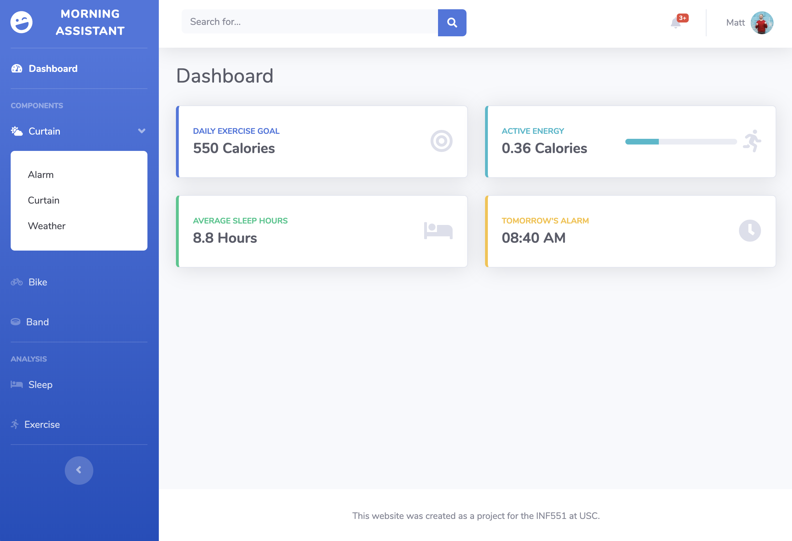

## Smart Morning Assistant

Mornings are arguably the most important and productive time of the days. It’s been reported that waking up healthily and exercising every morning can significantly help us start on a productive day. 

Our smart home IoT scenario is built on the ambition to create a more comfortable and natural way for you to wake up and a more goal-driven way to exercise in the morning. 

To better wake you up, instead of using loud alarm noises, we envision a smart curtain (which is already in development by several companies), to automatically open and bring in natural lights when the weather permits. To keep you focused on your exercise goal, we use the watch and continue to track your active calories burnt on smart bikes. 

### Techical Tools

#### Front-end Bootstrap Template:
[SB Admin 2](https://startbootstrap.com/template-overviews/sb-admin-2/): an open source admin dashboard theme for Bootstrap created by Start Bootstrap.

#### JavaScript Plugins:
- Time Picker
- [Slider](https://seiyria.com/bootstrap-slider/)
- Easytimer 
- Bootstrap Toggle

#### Cloud Database:
Firebase

#### Chart:
[Chart.js](https://www.chartjs.org)

#### API:
[OpenWeatherMap](https://openweathermap.org/)

### How to run it locally
`npm install`, then `npm start`
